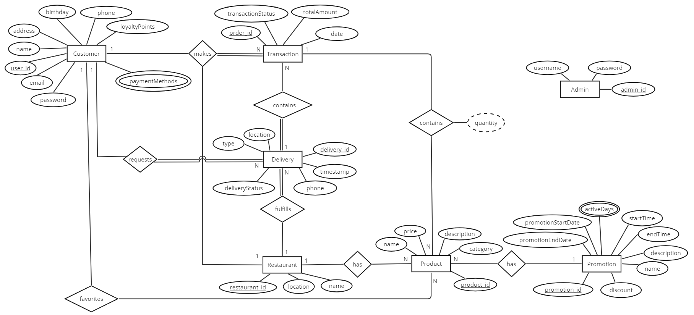
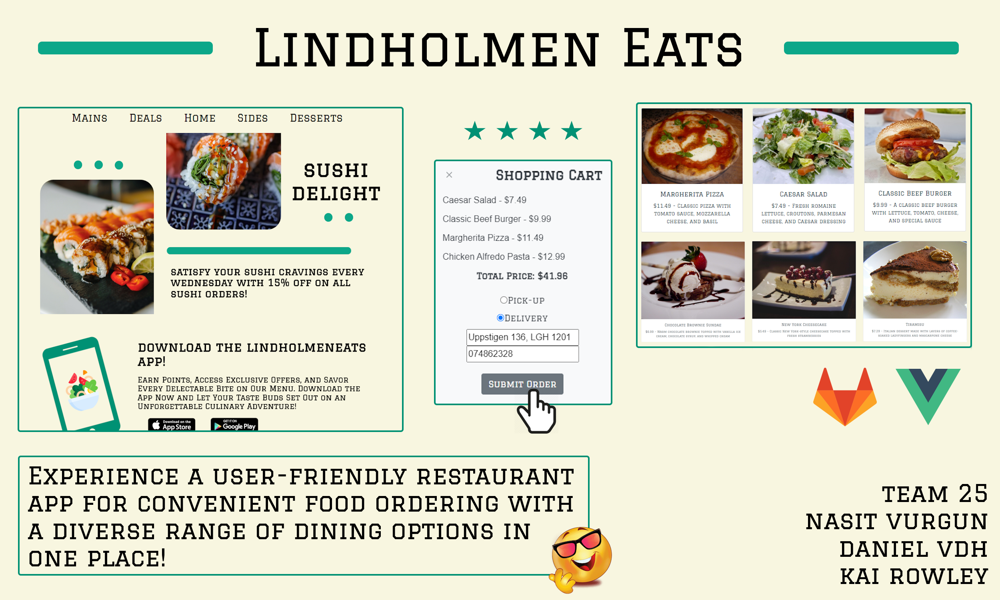

# Backend and Frontend Template

Latest version: https://git.chalmers.se/courses/dit342/group-00-web

This template refers to itself as `group-00-web`. In your project, use your group number in place of `00`.

## Project Structure

| File        | Purpose           | What you do?  |
| ------------- | ------------- | ----- |
| `server/` | Backend server code | All your server code |
| [server/README.md](server/README.md) | Everything about the server | **READ ME** carefully! |
| `client/` | Frontend client code | All your client code |
| [client/README.md](client/README.md) | Everything about the client | **READ ME** carefully! |
| [docs/DEPLOYMENT.md](docs/DEPLOYMENT.md) | Free online production deployment | Deploy your app online in production mode |
| [docs/LOCAL_DEPLOYMENT.md](docs/LOCAL_DEPLOYMENT.md) | Local production deployment | Deploy your app local in production mode |

## Requirements

The version numbers in brackets indicate the tested versions but feel free to use more recent versions.
You can also use alternative tools if you know how to configure them (e.g., Firefox instead of Chrome).

* [Git](https://git-scm.com/) (v2) => [installation instructions](https://www.atlassian.com/git/tutorials/install-git)
  * [Add your Git username and set your email](https://docs.gitlab.com/ce/gitlab-basics/start-using-git.html#add-your-git-username-and-set-your-email)
    * `git config --global user.name "YOUR_USERNAME"` => check `git config --global user.name`
    * `git config --global user.email "email@example.com"` => check `git config --global user.email`
  * > **Windows users**: We recommend to use the [Git Bash](https://www.atlassian.com/git/tutorials/git-bash) shell from your Git installation or the Bash shell from the [Windows Subsystem for Linux](https://docs.microsoft.com/en-us/windows/wsl/install-win10) to run all shell commands for this project.
* [Chalmers GitLab](https://git.chalmers.se/) => Login with your **Chalmers CID** choosing "Sign in with" **Chalmers Login**. (contact [support@chalmers.se](mailto:support@chalmers.se) if you don't have one)
  * DIT342 course group: https://git.chalmers.se/courses/dit342
  * [Setup SSH key with Gitlab](https://docs.gitlab.com/ee/ssh/)
    * Create an SSH key pair `ssh-keygen -t ed25519 -C "email@example.com"` (skip if you already have one)
    * Add your public SSH key to your Gitlab profile under https://git.chalmers.se/profile/keys
    * Make sure the email you use to commit is registered under https://git.chalmers.se/profile/emails
  * Checkout the [Backend-Frontend](https://git.chalmers.se/courses/dit342/group-00-web) template `git clone git@git.chalmers.se:courses/dit342/group-00-web.git`
* [Server Requirements](./server/README.md#Requirements)
* [Client Requirements](./client/README.md#Requirements)

## Getting started

```bash
# Clone repository
git clone git@git.chalmers.se:courses/dit342/group-00-web.git

# Change into the directory
cd group-00-web

# Setup backend
cd server && npm install
npm run dev

# Setup frontend
cd client && npm install
npm run serve
```

> Check out the detailed instructions for [backend](./server/README.md) and [frontend](./client/README.md).

## Visual Studio Code (VSCode)

Open the `server` and `client` in separate VSCode workspaces or open the combined [backend-frontend.code-workspace](./backend-frontend.code-workspace). Otherwise, workspace-specific settings don't work properly.

## System Definition (MS0)

### Purpose:

**LindholmenEats** is a user-friendly restaurant app for ordering food. You can customise your orders, track deliveries, save favourites, earn rewards, and choose your language and privacy settings. Enjoy easy access to a variety of restaurant offerings all in one place!

### Pages

* **Login / Sign Up page:** a login page which serves as the entry point for existing and new users, allowing them to either register as new users or log in using their existing credentials.
* **Home:** a landing page after logging in where the user is met with a variety of options where the users can explore and access key features of the app, including restaurant discovery, menu browsing, order placement, and more. 
* **Favourites:** the favourites page is designed to enhance user convenience and personalization.
* **Promotions**: List of promotions with links to order page
* **GDPR:** the GDPR page provides users with clear and comprehensive information about how we collect, use, store, and process their data.
* **Past Purchases:** a page which allows the user to keep track of your favourite orders with ease.
* **Menu:** a page containing a scrollable list of food items with images, prices, and their descriptions.
Specific Food Item: a page with the description of a food item and the quantity.
* **Order Page:** a page with a list of all selected items for order with a confirmation button.
* **Payment Page:** a page allowing users to enter payment and delivery information.
* **Payment Confirmation Page:** a page confirming a user’s payment.
* **Settings:** a page which allows the user to fine-tune their experience: customise preferences, manage notifications, etc.


### Entity-Relationship (ER) Diagram



## Teaser (MS3)


